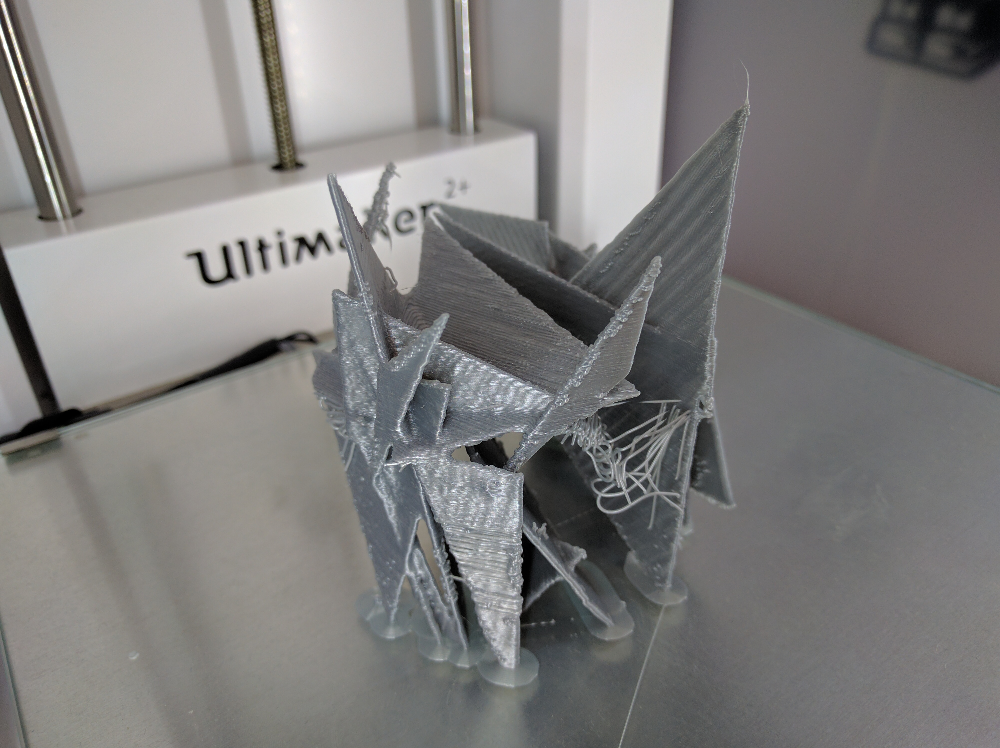
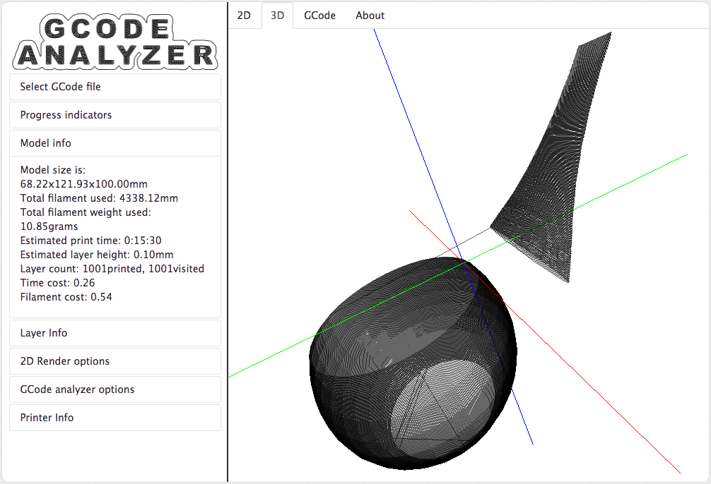
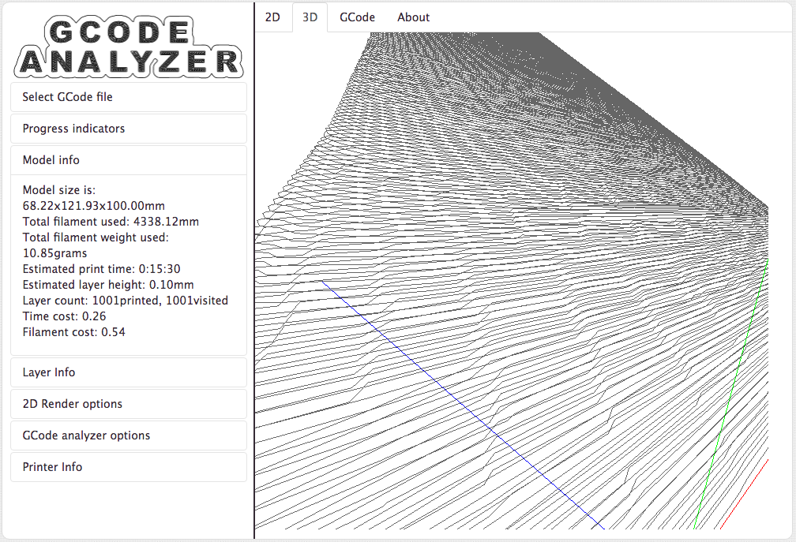
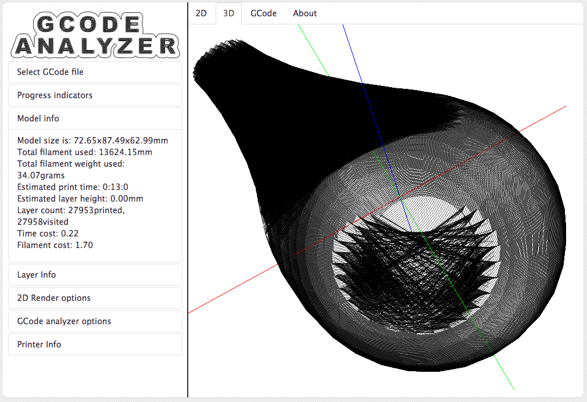

# 3Deeprinting

3D models generator based on Recurrent Neural Network ([LSTM](http://colah.github.io/posts/2015-08-Understanding-LSTMs/))
For more details see [The Unreasonable Effectiveness of Recurrent Neural Networks](http://karpathy.github.io/2015/05/21/rnn-effectiveness/) blog post.

## Goals

Generate new 3D models starting from already published ones.
P.S.: We didn't really know what we were doing, and that was **awesome**

## Main steps

- [collect](collect/) data scraping of STL models about pots and vases
- [convert](filter/) STL from/to GCode and Raw
- [generate](generate/) models, after training the generarive model.

# The journey

## The neural beast


### Ora et labora
```
Epoch 1/1
1556664/1556664 [==========] - 3553s - loss: 1.5400 
----- diversity: 0.2
----- Generating with seed: "l paese di canaan, ma il possesso della "
```
l paese di canaan, ma il possesso della mano di tale di noi di israele, come in questo comportare il signore dio, di acqua di giuda e di te in casa di israele, di contro di lui e la madre di sacchiera' alla terra di noi di in questo come un contro di te in questo contro di te in tutto il signore dio, che il signore dio e' in mezzo alla tua parola della costruzione del signore dio, **che il signore disse a te in casa di sacchiera' a chi sa**

### It's narmal

```
  facet normal -0.17081 -0.988312 0.0561681
    outer loop
      vertex -30.7425 -26.6532 9.91734
    endloop
  endfacet
  facet narmal 0.0603022 -0.763323 -0.617013
    outer loop
      vertex -1.50774 37.4165 54.4858
      vertex -30.065 -26.9583 7.9822
      vertex -37.6077 -4.31576 67.6813
      vertex -33.8138 -9.28438 22.0912
    endloop
  endfacet
  facet normal 0.624037 0.64761 0.43890
    outer loop
      vertex 15.7994 -37.9519 73.2936
      vertex 17.5564 -37.7542 77.3769
      vertex 15.0306 -40.7614 62.6957
      vertex 24.8122 39.7458 52.8605
      vertex 40.2831 18.9427 72.5635
      vertex 38.6411 17.7964 67.497
      vertex 36.6483 20.4316 57.9928
    endloop
  endfacet
```

### Let's move to a raw format

```
3.83574 37.8922 81.672 -2.22288 -39.6917 73.5789 -40.3215 -19.7543 64.9318
-37.911 -0.358 88.6243 -31.2575 -19.9934 44.6151 -27.0553 28.8427 59.8423
-40.0716 -3.20261 66.4769 -39.5815 -8.81896 66.8214 -0.741112 40.4982 50.8301
-40.7092 13.9279 62.5983 -31.3179 -24.7896 62.815 -33.6621 20.692 66.6478
-30.0387 -23.766 78.6458 -34.5819 23.9295 66.6997 -39.8961 -9.81622 17.2327
-39.8577 1.02898 77.1131 -0.46202 -40.0802 60.6339 16.65 38.7837 72.2011
...
```

### A 3Deeprinter on hallucinogens



### Improve deep network architecture






